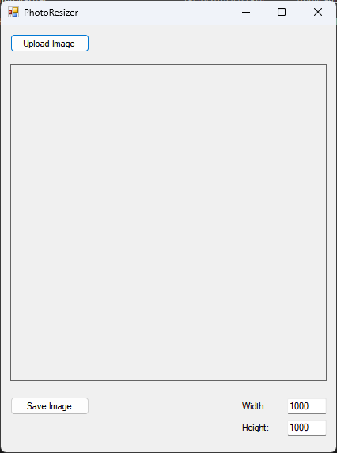

# PhotoResizer Application

## Overview

The **PhotoResizer Application** is a simple desktop app built in C# that allows users to upload an image, resize it to user-specified dimensions, and save the resized image to their computer. It features a graphical user interface (GUI) using Windows Forms.

## Features

- **Image Upload**: Users can upload image files in popular formats such as JPG, PNG, and BMP.
- **Custom Resizing**: The user can input custom dimensions (width and height) for resizing the image.
- **Image Preview**: The uploaded image is displayed in the app for preview before resizing.
- **Save Resized Image**: Users can save the resized image to their computer in JPG or PNG formats.

## Technologies Used

- **C#**: Programming language.
- **Windows Forms**: Used to create the graphical user interface (GUI).
- **GDI+**: Used for image manipulation (resizing).
- **OpenFileDialog & SaveFileDialog**: For selecting and saving image files.

## How to Run the Project

1. **Clone the repository** to your local machine:
    ```bash
    git clone <repository_url>
    ```

2. **Open the project** in Visual Studio.

3. **Build the project**:
   - Go to `Build > Build Solution`.

4. **Run the project**:
   - Press `F5` or go to `Debug > Start Debugging`.

5. **Upload an image**:
   - Click on the "Upload Image" button to select an image file from your computer.

6. **Input desired dimensions**:
   - Enter the width and height in the corresponding input fields.

7. **Save the resized image**:
   - Click "Save Resized Image" to save the image in your preferred format (JPG or PNG).

## Screenshots

### Main Screen


## Project Structure

```
PhotoResizerApp/
│
├── Form1.cs                    # Contains the logic for image upload, resize, and save
├── Form1.Designer.cs            # Contains the UI layout and controls
├── Form1.resx                   # Resource file for the form
├── Program.cs                   # Main entry point of the application
├── Properties/
│   ├── AssemblyInfo.cs          # Assembly information for the project
│   ├── Resources.Designer.cs    # Auto-generated resource management
│   ├── Settings.Designer.cs     # Settings management
├── bin/                         # Compiled binaries
├── obj/                         # Build files
└── README.md                    # Project README file
```

## Future Enhancements

- Add support for keeping the original aspect ratio while resizing.
- Enable drag-and-drop functionality for image uploads.
- Allow users to crop images before resizing.

## Contributing

If you'd like to contribute to this project, feel free to open a pull request or submit an issue.

## License

This project is licensed under the MIT License.
